# 🎓 Study Motivation Web App — Your Personal & Social Productivity Hub

The **Study Motivation Web App** is a full-stack platform built to help students stay productive, consistent, and socially accountable. With features like personal goals, streak tracking, Pomodoro timers, collaborative study rooms, and even a code playground — this app transforms how you study, code, and collaborate.

---

## 📌 Features

- Add and manage personal **tasks and goals**
- Mark items as **Starred** for quick access
- Maintain **daily goal streaks**
- **Friend system**: send, accept, or reject requests
- **Collab Rooms** to study with selected friends
- Real-time **chat** in study rooms
- Shared **group goals** with progress tracking
- **Built-in Code Playground** inside Collab Rooms for coding collaboration
- Multiple **timers**:
  - **Pomodoro Timer**  
  - **Stopwatch**  
  - **Custom Countdown Timer**
- Fully responsive interface

---

## ✨ Demo

### 🔹 HomePage Overview  
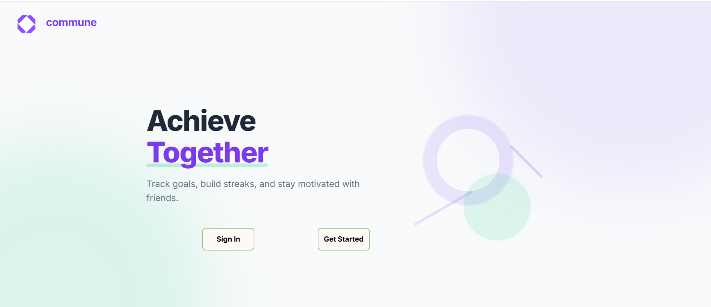

### 🔹 Login and Registration   
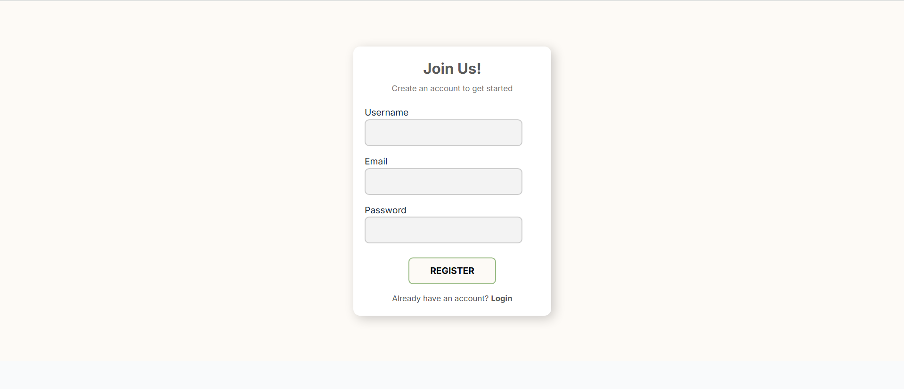
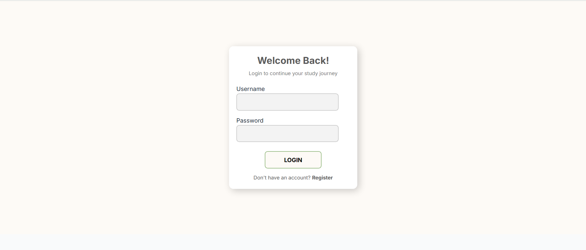

### 🔹 Dashboard Overview  
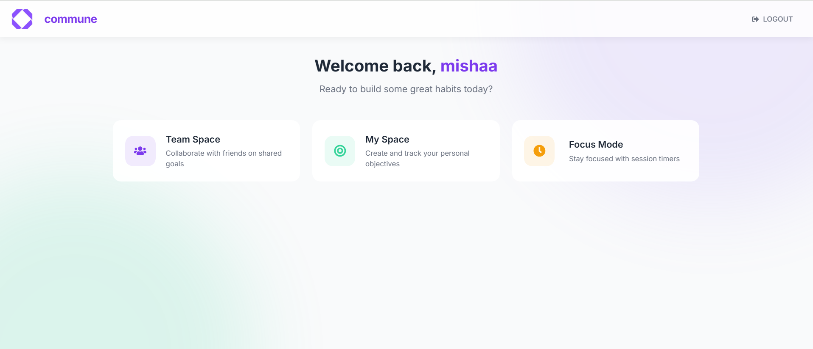

### 🔹 Collaboration Rooms  
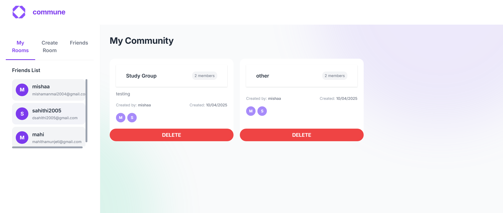
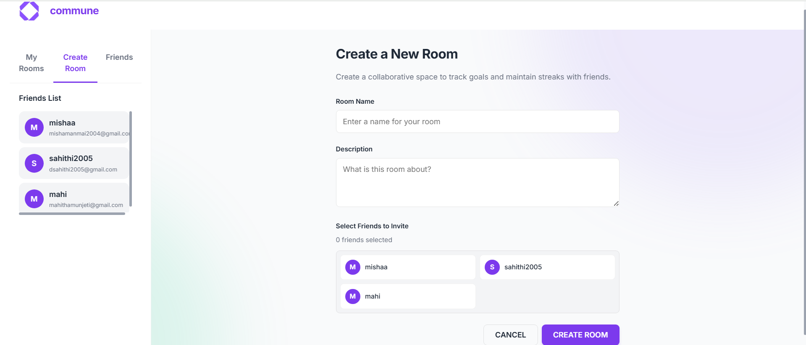

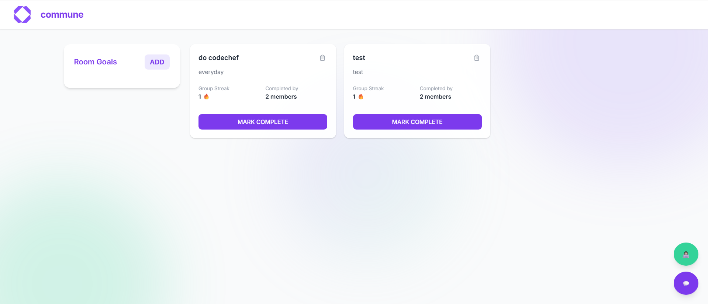
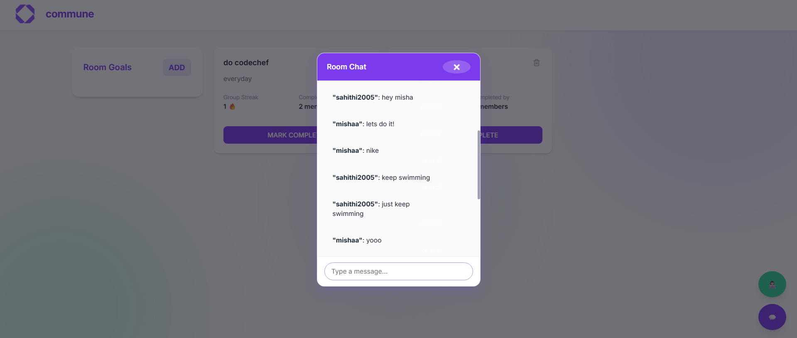
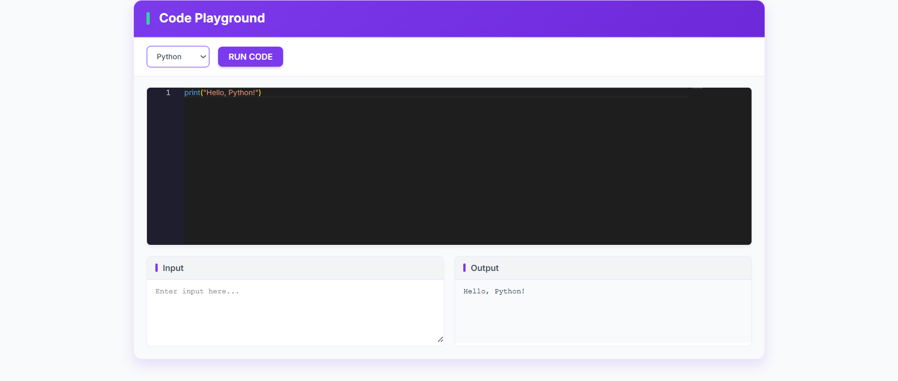

### 🔹 Personal Goal Setting  
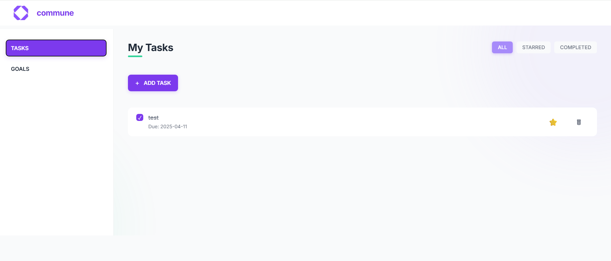
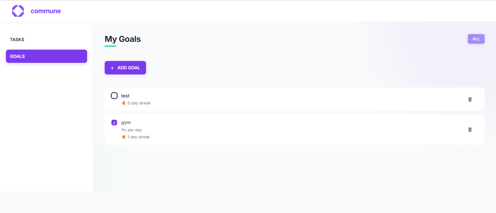

### 🔹 Timers  

<p align="center">
  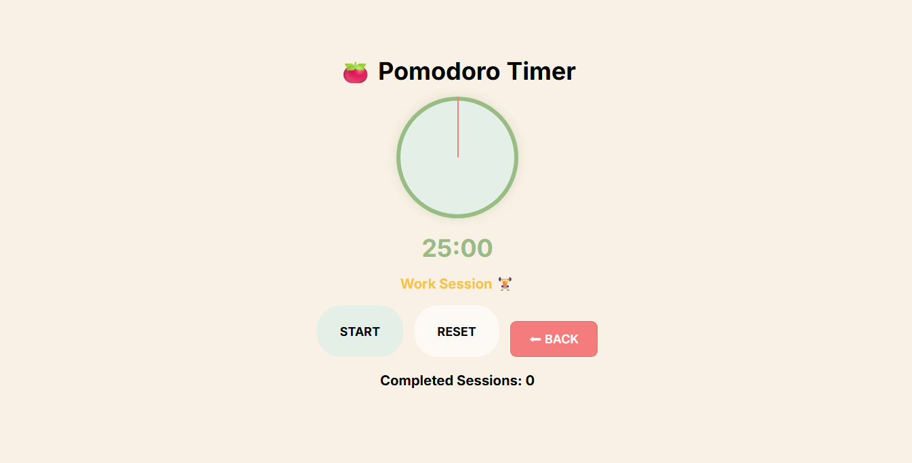
  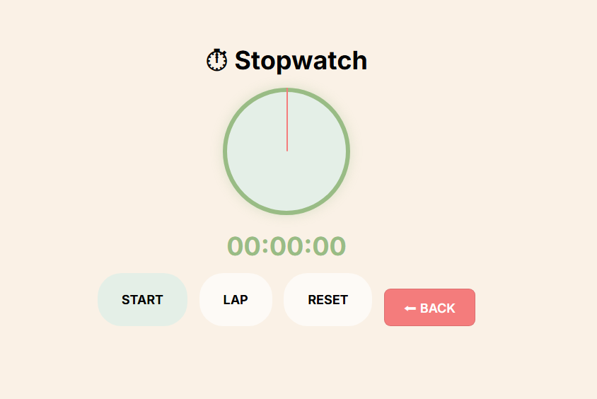
  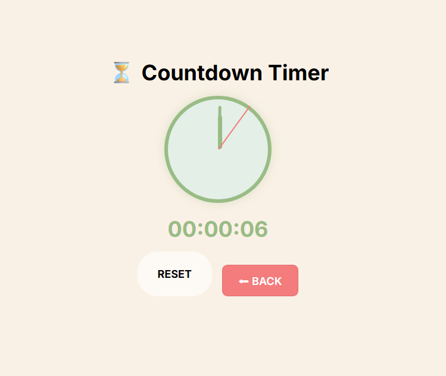
</p>

---

## 🛠 Tech Stack

### ⚙️ Backend
- **Node.js**, **Express.js**
- **MongoDB** with MongoClient
- **JWT**, **bcryptjs** for authentication

### 💻 Frontend
- **React.js**
- **CSS** for UI styling
- **Axios** for API communication

### 🔐 Authentication
- JSON Web Tokens (JWT) for secure login and route protection

### 👨‍💻 Code Editor
- Monaco Editor (used for the **Code Playground**)

---

## 🚀 How to Run the Project

### ✅ Requirements

- Node.js
- MongoDB (local or Atlas)
- React
- npm 

---

### 🎬 Setup Instructions

1. **Clone the repository**
```bash
git clone https://github.com/yourusername/study-motivation-app
cd study-motivation-app
```

2. **Run the Backend**
```bash
cd backend
npm install
node server.js
```

3. **Run the Frontend**
```bash
cd study-motivation-frontend
npm install
npm start
```

4. Open your browser and visit  
```
http://localhost:3000
```
 
---

## 🎯 Use Cases

- **Daily motivation** with goals and streaks  
- **Peer-based study accountability**  
- **Collaborative rooms** with task sharing and live chat  
- **Code together** via built-in editor  
- **Track time** with different timers for productivity  
- **Focus rooms** for group productivity experiments  

---

## 📌 Future Enhancements

- Calendar-based goal planner  
- Mobile app (React Native / PWA)  
- Push notifications for tasks and reminders  
- AI-powered goal suggestions and streak tips  
- Gamification and leaderboard  
